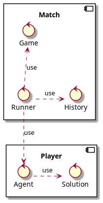
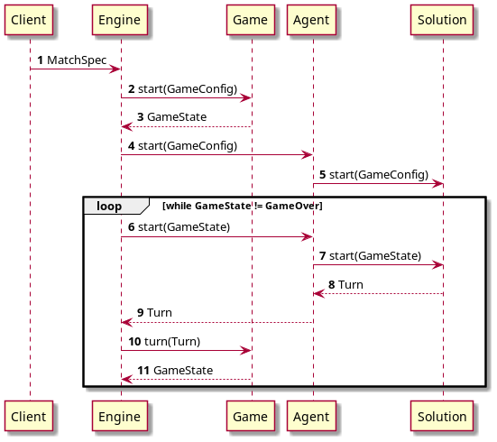

## Match flow

### Component diagram

### Component diagram

1. ### Engine

   API:
      - start(MatchSpec)

1. ### Game
   API:
      - start(): GameState
      - tick(turn: Turn?): State

1. ### History
1. ### Agent
   API:
      - start(GameState)
      - turn(state: GameState): Turn

1. ### Solution
   API:
      - start(GameState)
      - turn(state: GameState): Turn

## Types

**Turn**:

| name | desc |
|---|---|
| direction | LEFT or RIGHT |
| maxSpeed | max speed of  |

**GameConfig**

| name | desc |
|---|---|
| paddleAcceleration |  |
| ballSpeed |  |
| fieldSizes |  |
| bricksCount |  |

